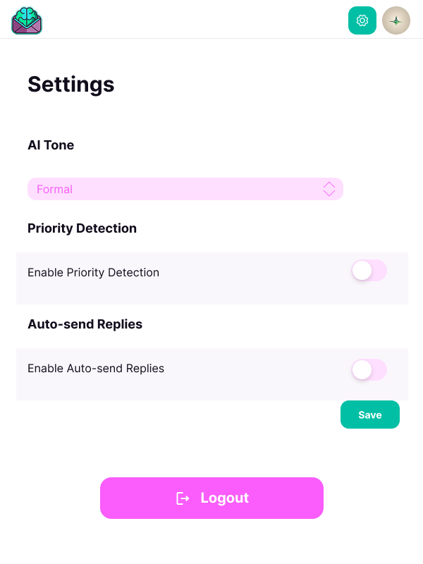

# MailMind: A Flutter AI-Powered Email Assistant Extension

**MailMind** is a smart Chrome extension built with Flutter that enhances email productivity using AI. It helps users generate quick, intelligent email replies, draft messages efficiently, and manage emails seamlessly—all within their Gmail inbox.

 **Note:** This extension is still under development. Stay tuned for updates!

## Features  

* **AI-Powered Email Replies** – Generate context-aware replies instantly.  
* **Draft Management** – Save and edit drafts before sending.  
* **Email Sending** – Send emails directly from the extension.  
* **Customizable AI Settings** – Adjust tone and style preferences for AI-generated replies.  
* **Secure Authentication** – OAuth2 integration with Gmail ensures privacy and security.  
* **Seamless Chrome Extension** – Works directly within Gmail for a smooth experience.  

## Technologies

* **Flutter:** Google's UI toolkit for building natively compiled applications for mobile, web, and desktop from a single codebase.
* **Dart:** Programming language optimized for building cross-platform apps with Flutter.
* **Bloc:** State management for predictable and scalable app states.
* **MVVM Pattern:** Ensures a clear separation of concerns and a more maintainable codebase.
* **API Integration:** Fetch book data from [Book API] for real-time updates.

## Screenshots  

| Welcome Screen | Main Screen | Settings Screen |  
|--------------------|-----------------|----------------|  
|  |  |  |  

## Getting Started  

### Prerequisites  

* Flutter SDK (latest stable version)  
* Dart SDK  
* Google Chrome (for testing the extension)  
* A Gmail account for API integration  

### Installation  

1. **Clone the repository:**  
   ```bash  
   git clone [your-repo-url]  
   cd mailmind_flutter_extension  
   ```  

2. **Install dependencies:**  
   ```bash  
   flutter pub get  
   ```  

3. **Run the project in Chrome:**  
   ```bash  
   flutter run -d chrome  
   ```  

4. **Build the extension for Chrome:**  
   ```bash  
   flutter build web  
   ```  
   This generates the extension files in `build/web/`.  

5. **Load as a Chrome extension:**  
   - Open Chrome and go to `chrome://extensions/`.  
   - Enable **Developer mode** (top right).  
   - Click **Load unpacked** and select the `build/web` folder.  
   - Your extension is now ready to use!  

## Contributing  

We welcome contributions to improve **MailMind**! If you’d like to contribute, please submit a pull request or report issues.  

### License
This project is licensed under the raufzer license.

